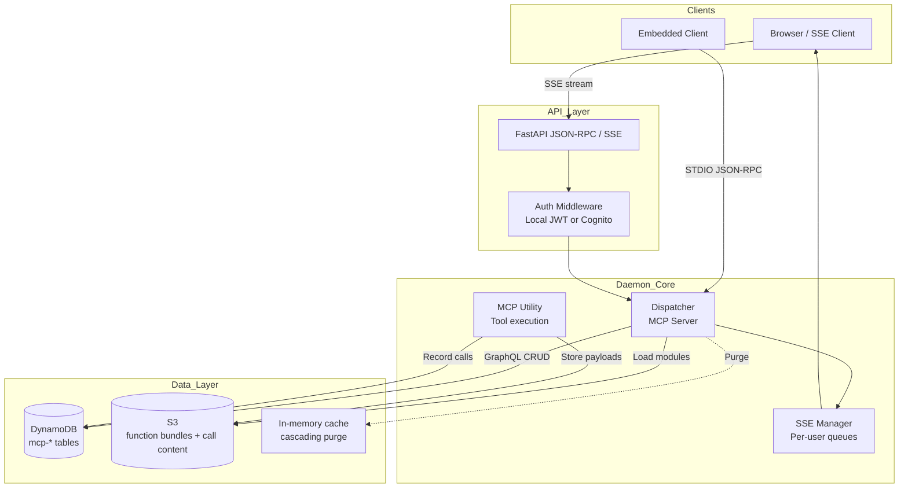
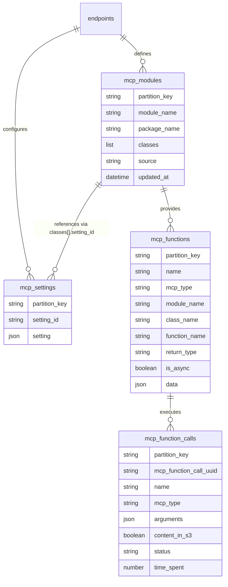

# AI MCP Daemon Engine

## Overview

**AI MCP Daemon Engine** is a thin daemon and CLI that exposes the [Model Context Protocol (MCP)](https://github.com/model-context-protocol/mcp) over HTTP **Server‑Sent Events (SSE)** or **STDIO**.

It bundles a FastAPI application that can:

* Stream assistant responses to browsers or other services via SSE
* Execute MCP *tools*, *resources* and *prompts* defined in an external JSON configuration
* Persist function metadata in DynamoDB through the **SilvaEngine** data layer
* Authenticate users with either **local JWTs** or **AWS Cognito**
* Dynamically download and extract Python functions from S3, allowing serverless style extensions

---

## Features

* **Pluggable Transport –** `jsonrpc/sse` (default) or `stdio` for embedded/PIPE use‑cases
* **Authentication –** Local JWT (with bcrypt‑hashed users) *or* Cognito JWT validation
* **GraphQL API –** CRUD operations for MCP functions and invocations (`mcp_core_graphql`)
* **Live Event Bus –** Replay‑buffered SSE stream with heartbeat and per‑user fan‑out
* **AWS Integrations –** S3 function bundles & DynamoDB storage via SilvaEngine helpers
* **Simple CLI** – `mcp‑daemon` starts the server with one command

---

### Architecture Diagram (Mermaid)



---

## Directory Layout

```text
ai_mcp_daemon_engine/
├── ai_mcp_daemon_engine/
│   ├── handlers/        # FastAPI, auth, SSE, utility helpers
│   ├── mutations/       # GraphQL mutations
│   ├── queries/         # GraphQL queries
│   ├── models/          # Pydantic / Graphene models
│   ├── main.py          # CLI entry‑point
│   └── __init__.py
├── pyproject.toml       # Build metadata & dependencies
└── README.md            # You are here
```

---

## Quick Start (Local JWT + SSE)

```bash
# Clone and install editable
$ git clone https://github.com/your‑org/ai_mcp_daemon_engine.git
$ cd ai_mcp_daemon_engine
$ python -m venv .venv && source .venv/bin/activate
$ pip install -e .

# Minimal env‑vars
export MCP_TRANSPORT=sse
export PORT=8000
export AUTH_PROVIDER=local
export ADMIN_USERNAME=admin
export ADMIN_PASSWORD=changeme

# Fire up the daemon
mcp-daemon
```

Visit `http://localhost:8000/docs` for interactive OpenAPI docs or connect to the SSE endpoint:

```bash
curl -N http://localhost:8000/default/mcp -H "Authorization: Bearer <token>"
```

---

## Project Status and Roadmap

- **Status**: Beta-ready daemon; ~75% complete. Core runtime, transport, auth, MCP integration, and GraphQL CRUD are complete; observability and testing modernization are in progress.
- **Architecture snapshot**: FastAPI JSON-RPC/SSE plus STDIO sidecar; DynamoDB persistence with tenant isolation via `partition_key`; dynamic function bundles from S3; cascading cache purge; pluggable auth (Local JWT or AWS Cognito).
- **Current hardening**: Adding structured logging, metrics (Prometheus/CloudWatch), rate limiting, and request-scoped caching.
- **Testing modernization**: Migrating legacy `unittest` to `pytest` with markers for `integration`, `sse`, `auth`, `mcp_core`, and `graphql`; coverage targets 80%+ overall and 90%+ for core handlers.
- **Planned features**: CI/CD pipelines, automated benchmarking, client SDK generation, multi-region replication support, and DataLoader-style batch queries for GraphQL.

### Recent Updates (v1.2.0 - December 2024)

- **Schema Migration**: Renamed `endpoint_id` → `partition_key` across all models for better multi-tenancy support and sub-partitioning flexibility
- **Query Caching**: Implemented `@method_cache` decorator on all `resolve_*_list` queries with 30-minute TTL
- **Cache Optimization**: Reduced DynamoDB read costs and improved response times through comprehensive query-level caching
- **Cascading Cache Purge**: Enhanced cache invalidation with proper parent-child relationship tracking

---

## Running with AWS Cognito

```bash
export AUTH_PROVIDER=cognito
export COGNITO_USER_POOL_ID="us-west-2_abc123"
export COGNITO_APP_CLIENT_ID="abcd1234"
export COGNITO_APP_SECRET="shhhh"
export COGNITO_JWKS_URL="https://cognito-idp.us-west-2.amazonaws.com/us-west-2_abc123/.well-known/jwks.json"

mcp-daemon
```

---

## Environment Variables

| Variable                                      | Default          | Description                                   |
| --------------------------------------------- | ---------------- | --------------------------------------------- |
| `MCP_TRANSPORT`                               | `sse`            | `jsonrpc/sse` (FastAPI) or `stdio` (pipe)     |
| `PORT`                                        | `8000`           | Listening port when using `jsonrpc/sse`       |
| `MCP_CONFIG_FILE`                             |  —               | Path to JSON defining tools/resources/prompts |
| `AUTH_PROVIDER`                               | `local`          | `local` or `cognito`                          |
| `LOCAL_USER_FILE`                             | `users.json`     | Local user DB (bcrypt‑hashed)                 |
| `ADMIN_USERNAME` / `ADMIN_PASSWORD`           | admin / admin123 | Bootstrap super‑admin                         |
| `ADMIN_STATIC_TOKEN`                          |  —               | Hard‑coded bearer token that bypasses login   |
| `JWT_SECRET_KEY`                              | CHANGEME         | HMAC secret for local JWTs                    |
| `ACCESS_TOKEN_EXP`                            | 15               | Token expiry in minutes                       |
| `COGNITO_*`                                   |  —               | Required when `AUTH_PROVIDER=cognito`         |
| `AWS_ACCESS_KEY_ID` / `AWS_SECRET_ACCESS_KEY` |  —               | For DynamoDB / S3 access                      |
| `REGION_NAME`                                 | us‑east‑1        | AWS region                                    |
| `FUNCT_BUCKET_NAME`                           |  —               | S3 bucket storing zipped function bundles     |
| `FUNCT_ZIP_PATH`                              |  —               | Where are the zip files stored locally        |
| `FUNCT_EXTRACT_PATH`                          | `/tmp/functions` | Where bundles are extracted locally           |

---

## Configuration File (MCP)

Supply a JSON blob that describes the endpoint’s capabilities and set its path via `MCP_CONFIG_FILE`:

```json
{
    "tools": [
        {
            "name": "hello",
            "description": "Greet someone",
            "inputSchema": {
                "type": "object",
                "properties": {
                    "name": {
                        "type": "string",
                        "description": "Name",
                        "default": "World"
                    }
                }
            },
            "annotations": null
        },
        {
            "name": "add_numbers",
            "description": "Add two numbers",
            "inputSchema": {
                "type": "object",
                "properties": {
                    "a": {
                        "type": "integer",
                        "description": "First number"
                    },
                    "b": {
                        "type": "integer",
                        "description": "Second number"
                    }
                },
                "required": [
                    "a",
                    "b"
                ]
            },
            "annotations": null
        }
    ],
    "resources": [
        {
            "uri": "status://server",
            "name": "Server Status",
            "description": "Status info",
            "mimeType": "text/plain",
            "size": null,
            "annotations": null
        }
    ],
    "prompts": [
        {
            "name": "example-prompt",
            "description": "An example prompt template",
            "arguments": [
                {
                    "name": "arg1",
                    "description": "Example argument",
                    "required": true
                }
            ]
        }
    ],
    "module_links": [
        {
            "type": "tool",
            "name": "hello",
            "module_name": "mcp_function_demo",
            "class_name": "MCPFunctionDemo",
            "function_name": "hello",
            "return_type": "text"
        },
        {
            "type": "tool",
            "name": "add_numbers",
            "module_name": "mcp_function_demo",
            "class_name": "MCPFunctionDemo",
            "function_name": "add_numbers",
            "return_type": "text"
        },
        {
            "type": "resource",
            "name": "Server Status",
            "module_name": "mcp_function_demo",
            "class_name": "MCPFunctionDemo",
            "function_name": "read_resource"
        },
        {
            "type": "prompt",
            "name": "example-prompt",
            "module_name": "mcp_function_demo",
            "class_name": "MCPFunctionDemo",
            "function_name": "get_prompt"
        }
    ],
    "modules": [
        {
            "package_name": "mcp_function_demo",
            "module_name": "mcp_function_demo",
            "class_name": "MCPFunctionDemo",
            "setting": {}
        }
    ]
}
```

---

## Model Relationships

### Relationship Overview

```
PARTITION (partition_key: tenant isolation boundary)
    |
    |-- MCP MODULE (module_name, package_name, classes[])
    |       |
    |       |-- classes[].setting_id ---> MCP SETTING (setting_id, setting map)
    |       |
    |       |-- module_name/class_name ---> MCP FUNCTION (name, mcp_type, data, return_type, is_async)
    |                   |
    |                   |-- name/mcp_type ---> MCP FUNCTION CALL (mcp_function_call_uuid, arguments, status)
    |                                   |
    |                                   |-- optional content in S3: mcp_content/<uuid>.json when content_in_s3=true
```

### Core Entities

- **MCPModuleModel**: Catalog of executable Python modules; stores `module_name`, `package_name`, `classes[]` (each class may carry a `setting_id`), optional `source` for provenance.
- **MCPFunctionModel**: Logical MCP definitions (`tool` / `resource` / `prompt`); keeps schema in `data`, links to executable code via `module_name` / `class_name` / `function_name`, and tracks `return_type` plus `is_async`.
- **MCPFunctionCallModel**: Execution log for MCP functions; captures `arguments`, `status`, time metrics, and flags whether payload is persisted.
- **MCPSettingModel**: Shared configuration blob; typically generated during config import and referenced by `classes[].setting_id`.

### Relationship Patterns

| Parent | Child | Linking Field(s) | Notes |
| ------ | ----- | ---------------- | ----- |
| `partition_key` | All models | `partition_key` (hash key) | Multi-tenant boundary for every table. Supports simple (`endpoint_id`) or composite (`endpoint_id#part_id`) partitioning. |
| MCPModule | MCPSetting | `classes[].setting_id` → `setting_id` | Module classes point to a shared setting document built during config import. |
| MCPModule | MCPFunction | `module_name` / `class_name` | Functions reference the Python module/class implementing the MCP tool/resource/prompt. |
| MCPFunction | MCPFunctionCall | `name` (+ `mcp_type`) | Call records keep the logical MCP name/type they executed; also used for cache invalidation. |
| MCPFunctionCall | S3 Content | `mcp_function_call_uuid` | When `content_in_s3` is true, payload is stored at `mcp_content/<uuid>.json` in the configured S3 bucket. |

### Key Structures & Indexes

| Model | Hash Key | Range Key | Secondary Indexes | Purpose |
| ----- | -------- | --------- | ----------------- | ------- |
| MCPModuleModel | `partition_key` | `module_name` | `package_name-index` (LSI) | Query modules by package or module name per partition. |
| MCPFunctionModel | `partition_key` | `name` | `mcp_type-index` (LSI) | Filter tools/resources/prompts by MCP type. |
| MCPFunctionCallModel | `partition_key` | `mcp_function_call_uuid` | `mcp_type-index`, `name-index` (LSIs) | Slice executions by MCP type or logical name. |
| MCPSettingModel | `partition_key` | `setting_id` | — | Shared module configuration. |

### Cache Cascade

Cached reads are invalidated with parent → child propagation:
- Purging a module also clears linked function caches (and their referenced settings).
- Purging a function clears its call list caches.

### Model ER Diagram (Mermaid)



---

## CLI Reference

```bash
mcp-daemon              # start the SSE server
mcp-daemon --help       # show command options (transport, port, etc.)
```

---

## API Highlights

| Method | Path           | Purpose                   |
| ------ | -------------- | ------------------------- |
| `POST` | `/auth/login`  | Obtain JWT (local)        |
| `GET`  | `/jsonrpc/sse` | Connect to the SSE stream |
| `POST` | `/mcp`         | Process MCP messages      |
| `GET`  | `/graphql`     | GraphQL Playground (dev)  |

OpenAPI is served at `/docs` and ReDoc at `/redoc`.

---

## Development & Testing

### Installation

```bash
# Clone and install in development mode
git clone https://github.com/silvaengine/ai_mcp_daemon_engine.git
cd ai_mcp_daemon_engine
python -m venv .venv && source .venv/bin/activate
pip install -e ".[dev]"
```

### Running Tests

```bash
# Run all tests
pytest

# Run with coverage report
pytest --cov=ai_mcp_daemon_engine --cov-report=html

# Run specific test markers
pytest -m unit           # Fast unit tests
pytest -m integration    # Integration tests (requires AWS)
pytest -m sse            # SSE-specific tests
pytest -m auth           # Authentication tests
```

### Documentation

For detailed development guidelines, schema documentation, caching architecture, and complete development plan, see [docs/DEVELOPMENT_PLAN.md](docs/DEVELOPMENT_PLAN.md).

---

## Deployment Tips

* **Docker** – multi‑stage build; expose `$PORT` (default 8000).
* **AWS Fargate / ECS** – stateless; mount S3 via SDK.
* **Kubernetes** – use ConfigMap/Secret for env‑vars; readiness probe on `/docs`.

Use `MCP_TRANSPORT=stdio` to embed the daemon into another Python process.

---

## License

Distributed under the MIT License. See `LICENSE` for more information.

---

## Acknowledgements

* [Model Context Protocol](https://github.com/model-context-protocol/mcp)
* [FastAPI](https://fastapi.tiangolo.com/)
* [SilvaEngine Utility](https://pypi.org/project/SilvaEngine-Utility/)
* [AWS Cognito](https://aws.amazon.com/cognito/)
