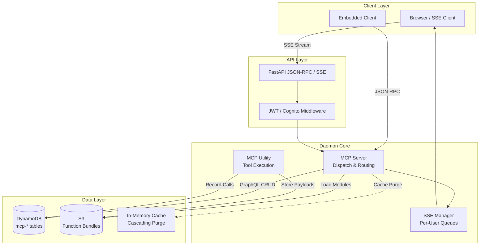
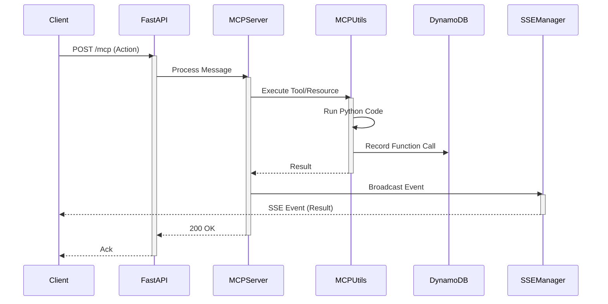
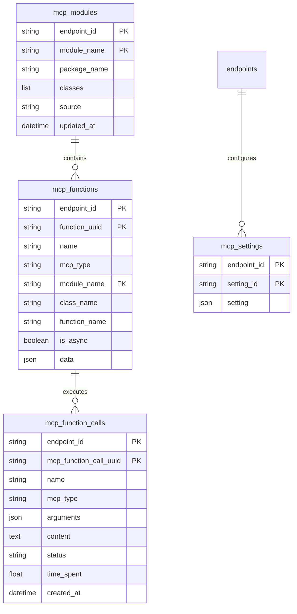

# AI MCP Daemon Engine: Comprehensive Development Plan

> **Project Status**: 🟢 Beta-Ready Daemon | 🟡 75% Complete | **Last Updated**: Nov 30, 2025
>
> **Quick Links**: [Current Status](#implementation-status) | [Roadmap](#development-roadmap) | [Architecture](#system-architecture)

## Executive Summary

The **AI MCP Daemon Engine** is a lightweight, high-performance runtime for the **Model Context Protocol (MCP)**. It is designed to run as either a scalable HTTP **SSE/JSON-RPC** service or an embedded **STDIO** sidecar. The engine provides a robust foundation for AI agent tool execution, offering pluggable authentication (Local/Cognito), dynamic function loading from S3, and comprehensive observability via GraphQL and DynamoDB.

### 📊 Project Progress Overview

```
Core Runtime:         ████████████████████ 100% ✅ Complete
Transport (SSE/Stdio):████████████████████ 100% ✅ Complete
Auth System:          ████████████████████ 100% ✅ Complete
GraphQL API:          ██████████████████░░  90% 🟢 Stable
MCP Integration:      ████████████████████ 100% ✅ Complete
Observability:        ████████████░░░░░░░░  60% 🟡 In Progress
Testing Framework:    ████████░░░░░░░░░░░░  40% 🟠 Needs Modernization
Documentation:        ██████████████░░░░░░  70% 🟡 Good
──────────────────────────────────────────────────────
Overall Progress:     ███████████████░░░░░  75% 🟡 In Progress
```

### Core Architecture

**Technology Stack:**
- **Transport**: FastAPI (SSE/JSON-RPC) & Standard IO (Pipe)
- **Database**: AWS DynamoDB with `SilvaEngine` data layer
- **GraphQL**: Graphene-based schema for management and history
- **Auth**: Pluggable middleware (Local JWT/Bcrypt or AWS Cognito)
- **Execution**: Threaded async worker pool for non-blocking MCP calls
- **Storage**: S3 integration for dynamic function bundles
- **Caching**: Cascading cache purging for DynamoDB entities

**Key Design Patterns:**
1. **Dual Transport Mode**: Seamlessly switch between HTTP Server and CLI Sidecar.
2. **Stateless Core**: Relies on DynamoDB for persistence; suitable for Fargate/Lambda.
3. **Dynamic Loading**: Fetches and extracts Python function bundles from S3 on demand.
4. **Live Event Bus**: Replay-buffered SSE stream with per-user fan-out.
5. **Tenant Isolation**: All data partitioned by `endpoint_id`.

---

## Table of Contents

1. [System Architecture](#system-architecture)
2. [Data Model](#data-model)
3. [Implementation Status](#implementation-status)
4. [Development Roadmap](#development-roadmap)
5. [Performance Optimization](#performance-optimization)
6. [Testing Strategy](#testing-strategy)
7. [Deployment](#deployment)

---

## System Architecture

### High-Level Architecture



### Execution Flow (SSE Mode)



---

## Data Model

### ER Diagram Overview



### Model Inventory

The platform consists of **4 core models** optimized for MCP operations:

#### 1. Core MCP Models

| Model | Table | Purpose | Implementation | Status |
|-------|-------|---------|----------------|--------|
| **MCPModule** | `mcp-modules` | Registered Python packages/modules | `models/mcp_module.py` | ✅ Complete |
| **MCPFunction** | `mcp-functions` | Tool/Resource/Prompt definitions | `models/mcp_function.py` | ✅ Complete |
| **MCPFunctionCall** | `mcp-function_calls` | Execution history & logs | `models/mcp_function_call.py` | ✅ Complete |
| **MCPSetting** | `mcp-settings` | Per-endpoint configuration | `models/mcp_setting.py` | ✅ Complete |

---

## Implementation Status

### 📊 Overall Progress: **75% Complete**

#### ✅ Completed Components (100%)

**Core Infrastructure** (✅ **COMPLETED**)
- [x] Dual Transport Architecture (SSE + Stdio)
- [x] DynamoDB integration via `SilvaEngine`
- [x] S3 integration for function bundles
- [x] Cascading Cache Purger hooks
- **Status**: ✅ Production-ready core

**Authentication & Security** (✅ **COMPLETED**)
- [x] Local JWT Auth (Bcrypt + HS256)
- [x] AWS Cognito Integration (JWKS validation)
- [x] Pluggable Auth Middleware
- [x] Static Admin Token support
- **Status**: ✅ Flexible and secure

**MCP Runtime** (✅ **COMPLETED**)
- [x] Tool, Resource, and Prompt dispatching
- [x] Dynamic module loading from S3
- [x] SSE Heartbeat and connection management
- [x] GraphQL CRUD for all entities
- **Status**: ✅ Fully operational

#### 🟡 In Progress (60%)

**Observability & Hardening** (🟡 **IN PROGRESS**)
- [x] Basic logging
- [ ] Structured logging (JSON)
- [ ] Prometheus/CloudWatch metrics
- [ ] Rate limiting middleware
- [ ] Request-scoped caching
- **Status**: 🟡 Basic visibility, needs production hardening

**Testing Infrastructure** (🟠 **NEEDS WORK**)
- [x] Legacy `unittest` suite (`test_ai_mcp_daemon_engine.py`)
- [ ] Migration to `pytest`
- [ ] Fixtures for DynamoDB/S3 mocking
- [ ] SSE integration tests
- **Status**: 🟠 Functional but outdated

#### ⏳ Planned (0%)

**Advanced Features**
- [ ] CI/CD Pipelines
- [ ] Automated Benchmarking
- [ ] Client SDK generation
- [ ] Multi-region replication support

---

## Development Roadmap

### Current Optimizations ✅

#### 1. Cascading Cache Purge
- **Status:** ✅ Implemented
- **Impact:** Ensures data consistency across distributed reads
- **Pattern:** Updates to `MCPModule` invalidate related `MCPFunction` caches.

#### 2. Dynamic Bundle Loading
- **Status:** ✅ Implemented
- **Impact:** Allows serverless-style extension without rebuilding the daemon
- **Pattern:** Downloads and extracts ZIPs from S3 to `/tmp` on demand.

### Planned Optimizations ⏳

#### 1. Request-Scoped Caching
- **Status:** ⏳ Planned (Phase 2)
- **Expected Impact:** Reduce redundant DB lookups during complex tool chains.
- **Pattern:** `context`-bound cache for the duration of a request.

#### 2. Batch Loading (DataLoaders)
- **Status:** ⏳ Planned (Phase 3)
- **Expected Impact:** Eliminate N+1 queries in GraphQL list views.
- **Pattern:** Batch keys and fetch from DynamoDB in parallel.

---

## Testing Strategy

### Test Pyramid

```
                    ┌─────────────┐
                    │   E2E (10%) │
                    │   SSE Flow  │
                    ├─────────────┤
                    │ Integration │
                    │   (30%)     │
                    │   DB/Auth   │
                    ├─────────────┤
                    │    Unit     │
                    │   (60%)     │
                    │  Logic/MCP  │
                    └─────────────┘
```

### Test Markers (Planned)

```python
pytest.mark.unit              # Pure logic tests
pytest.mark.integration       # DB/S3 integration tests
pytest.mark.sse               # SSE streaming tests
pytest.mark.auth              # Authentication flows (Local/Cognito)
pytest.mark.mcp_core          # Tool/Resource execution logic
pytest.mark.graphql           # API schema validation
```

### Running Tests

```bash
# Current (Legacy)
pytest

# Future (Target)
pytest -m "not integration"  # Fast tests
pytest -m integration        # Slow tests
```

### Test Coverage Goals

- **Overall Coverage:** >= 80%
- **Core Handlers:** >= 90%
- **Auth Middleware:** >= 95%
- **Utilities:** >= 85%

---

## Deployment

### Infrastructure

**Components:**
- **Container:** Docker / AWS Fargate (Stateless)
- **Database:** AWS DynamoDB
- **Storage:** AWS S3 (Function Bundles)
- **Auth:** AWS Cognito (Optional)

### Environment Configuration

**Required Variables:**
```bash
# Core
MCP_TRANSPORT=sse|stdio
PORT=8000
MCP_CONFIG_FILE=path/to/config.json

# Auth
AUTH_PROVIDER=local|cognito
JWT_SECRET_KEY=<secret>
COGNITO_USER_POOL_ID=<id>

# AWS
AWS_REGION=us-east-1
FUNCT_BUCKET_NAME=<bucket>
```

### Deployment Process

1. **Build**: Create Docker image or Python wheel.
2. **Configure**: Set env vars for target environment (Dev/Prod).
3. **Deploy**: Push to ECS/Fargate or install on VM.
4. **Bootstrap**: Run with `INITIALIZE_TABLES=1` if fresh DB.

---

## Monitoring & Observability

### Key Metrics

- **SSE Connections**: Active user count.
- **MCP Latency**: Time taken to execute tools.
- **Error Rate**: 5xx responses or tool failures.
- **DynamoDB Capacity**: RCU/WCU consumption.

### Logging

- **Format**: JSON structured logs (planned).
- **Levels**: INFO (default), DEBUG (trace), ERROR (alerts).

---

## Security

### Authentication & Authorization

- **Local**: Bcrypt password hashing, JWT issuance.
- **Cognito**: External identity provider, JWKS token verification.
- **Admin**: Static token bypass for bootstrapping/CI.

### Data Protection

- **Transport**: TLS required for SSE/HTTP.
- **Storage**: DynamoDB encryption at rest.
- **Isolation**: Tenant data isolated by `endpoint_id`.

---

## Contributing

1. **Branch**: `feature/your-feature`
2. **Test**: Run `pytest` before push.
3. **Lint**: Use `ruff` for formatting.
4. **PR**: Submit with description of changes.

---

**Document Version:** 1.0
**Maintainer:** AI MCP Daemon Engine Team
