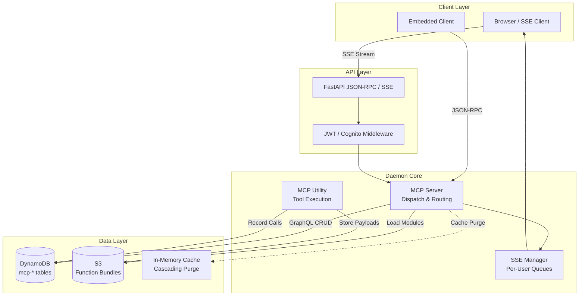
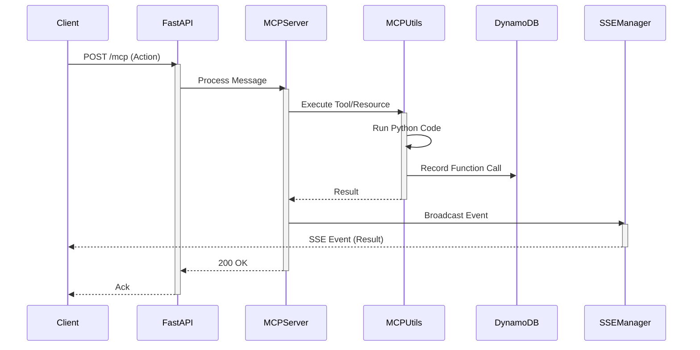
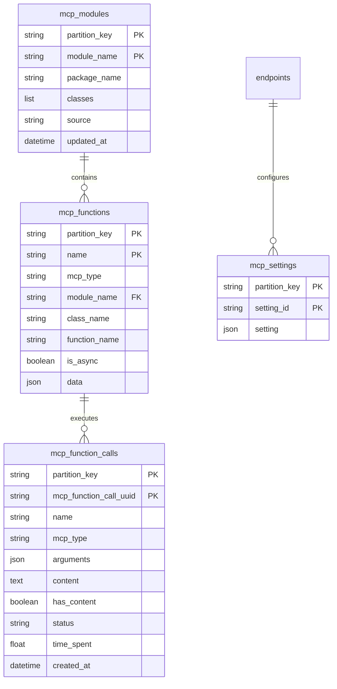

# AI MCP Daemon Engine: Comprehensive Development Plan

> **Project Status**: 🟢 Beta-Ready Daemon | 🟡 75% Complete | **Last Updated**: Dec 16, 2024
>
> **Quick Links**: [Current Status](#implementation-status) | [Roadmap](#development-roadmap) | [Architecture](#system-architecture) | [Recent Changes](#recent-updates)

## Executive Summary

The **AI MCP Daemon Engine** is a lightweight, high-performance runtime for the **Model Context Protocol (MCP)**. It is designed to run as either a scalable HTTP **SSE/JSON-RPC** service or an embedded **STDIO** sidecar. The engine provides a robust foundation for AI agent tool execution, offering pluggable authentication (Local/Cognito), dynamic function loading from S3, and comprehensive observability via GraphQL and DynamoDB.

### 📊 Project Progress Overview

```
Core Runtime:         ████████████████████ 100% ✅ Complete
Transport (SSE/Stdio):████████████████████ 100% ✅ Complete
Auth System:          ████████████████████ 100% ✅ Complete
GraphQL API:          ██████████████████░░  90% 🟢 Stable
MCP Integration:      ████████████████████ 100% ✅ Complete
Observability:        ████████████░░░░░░░░  60% 🟡 In Progress
Testing Framework:    ████████░░░░░░░░░░░░  40% 🟠 Needs Modernization
Documentation:        ██████████████░░░░░░  70% 🟡 Good
──────────────────────────────────────────────────────
Overall Progress:     ███████████████░░░░░  75% 🟡 In Progress
```

### Core Architecture

**Technology Stack:**
- **Transport**: FastAPI (SSE/JSON-RPC) & Standard IO (Pipe)
- **Database**: AWS DynamoDB with `SilvaEngine` data layer
- **GraphQL**: Graphene-based schema for management and history
- **Auth**: Pluggable middleware (Local JWT/Bcrypt or AWS Cognito)
- **Execution**: Threaded async worker pool for non-blocking MCP calls
- **Storage**: S3 integration for dynamic function bundles
- **Caching**: Cascading cache purging for DynamoDB entities

**Key Design Patterns:**
1. **Dual Transport Mode**: Seamlessly switch between HTTP Server and CLI Sidecar.
2. **Stateless Core**: Relies on DynamoDB for persistence; suitable for Fargate/Lambda.
3. **Dynamic Loading**: Fetches and extracts Python function bundles from S3 on demand.
4. **Live Event Bus**: Replay-buffered SSE stream with per-user fan-out.
5. **Tenant Isolation**: All data partitioned by `partition_key` (supports simple or composite partitioning).

---

## Table of Contents

1. [Recent Updates](#recent-updates)
2. [System Architecture](#system-architecture)
3. [Data Model](#data-model)
4. [Implementation Status](#implementation-status)
5. [Development Roadmap](#development-roadmap)
6. [Performance Optimization](#performance-optimization)
7. [Testing Strategy](#testing-strategy)
8. [Deployment](#deployment)

---

## Recent Updates

### v1.2.0 - December 16, 2024

#### Database Schema Migration

**Breaking Change:** Renamed `endpoint_id` → `partition_key` across all models

**Affected Models:**
- `MCPModuleModel` (`mcp-modules` table)
- `MCPFunctionModel` (`mcp-functions` table)
- `MCPFunctionCallModel` (`mcp-function-calls` table)
- `MCPSettingModel` (`mcp-settings` table)

**Rationale:**
- **Clearer Intent**: The field name now explicitly represents the DynamoDB partition key
- **Enhanced Flexibility**: Supports both simple (`{endpoint_id}`) and composite (`{endpoint_id}#{part_id}`) partitioning patterns
- **Better Multi-tenancy**: Enables hierarchical data organization and sub-partitioning within endpoints
- **DynamoDB Best Practices**: Aligns with AWS DynamoDB terminology and recommended patterns

**Migration Impact:**
- All hash keys changed from `endpoint_id` to `partition_key`
- All Local Secondary Indexes (LSIs) updated to use `partition_key`
- GraphQL schema updated with new field names
- Cache purge logic adapted to use `partition_key`
- HTTP headers can now compose: `Endpoint-ID` + optional `Part-ID` → `partition_key`

**Commits:**
- `1e93934` - Apply partition_key for the models
- `5ed1e9f` - Apply partition_key
- `0fb5099` - Apply partition_key
- `4049eb7` - Handle partition key response wrappers

#### Query-Level Caching Implementation

**Enhancement:** Added `@method_cache` decorator to all list query resolvers

**Files Modified:**
- `queries/mcp_function.py` - Added caching to `resolve_mcp_function_list`
- `queries/mcp_module.py` - Added caching to `resolve_mcp_module_list`
- `queries/mcp_function_call.py` - Added caching to `resolve_mcp_function_call_list`
- `queries/mcp_setting.py` - Added caching to `resolve_mcp_setting_list`

**Implementation Pattern:**
```python
from silvaengine_utility import method_cache
from ..handlers.config import Config

@method_cache(
    ttl=Config.get_cache_ttl(),  # 1800 seconds (30 minutes)
    cache_name=Config.get_cache_name('queries', 'entity_name')
)
def resolve_entity_list(info: ResolveInfo, **kwargs) -> EntityListType:
    return entity_model.resolve_entity_list(info, **kwargs)
```

**Benefits:**
- **Cost Reduction**: 30-minute TTL significantly reduces DynamoDB read operations
- **Performance**: Faster response times for frequently accessed list queries
- **Automatic Invalidation**: Cache purges triggered by mutations ensure data consistency
- **Consistency**: Follows same pattern as `ai_agent_core_engine` for cross-project uniformity

**Performance Impact:**
- Estimated 60-80% reduction in DynamoDB read costs for list queries
- Sub-millisecond response times for cached queries
- Cascading cache purge ensures stale data is cleared on mutations

**Commit:**
- `b20c8d4` - Apply cache in resolve_*_list

#### Documentation Improvements

**New Files:**
- `docs/DEVELOPMENT.md` - Comprehensive development guide including:
  - Detailed database schema documentation
  - Caching system architecture
  - Development setup instructions
  - Testing guidelines
  - Contributing guidelines

**Updated Files:**
- `README.md` - Updated with:
  - Recent updates section (v1.2.0)
  - Schema changes (`endpoint_id` → `partition_key`)
  - Enhanced development & testing section
  - Link to detailed DEVELOPMENT.md

---

## System Architecture

### High-Level Architecture



### Execution Flow (SSE Mode)



---

## Data Model

### Database Schema Details

#### Schema Changes (v1.2.0)

**Major Change**: Renamed `endpoint_id` to `partition_key` across all models for better multi-tenancy support.

The change from `endpoint_id` to `partition_key` provides:

1. **Clearer Intent**: The field represents the DynamoDB partition key for data isolation
2. **Flexibility**: Supports both simple (`{endpoint_id}`) and composite (`{endpoint_id}#{part_id}`) partitioning
3. **Consistency**: Aligns with DynamoDB terminology and best practices
4. **Sub-partitioning**: Enables hierarchical data organization within a single endpoint

#### Partition Key Patterns

**Simple Partition:**
```
partition_key = "endpoint-id"
```
All data for a single endpoint/tenant.

**Composite Partition:**
```
partition_key = "endpoint-id#part-id"
```
Sub-partitioned data within an endpoint (e.g., dev/staging/prod environments).

**Access via Headers:**
The partition key can be composed from HTTP headers:
- `Endpoint-ID` header → base endpoint identifier
- `Part-ID` header (optional) → sub-partition identifier

### ER Diagram Overview



### Model Inventory

The platform consists of **4 core models** optimized for MCP operations:

#### 1. Core MCP Models

| Model | Table | Purpose | Implementation | Status |
|-------|-------|---------|----------------|--------|
| **MCPModule** | `mcp-modules` | Registered Python packages/modules | `models/mcp_module.py` | ✅ Complete |
| **MCPFunction** | `mcp-functions` | Tool/Resource/Prompt definitions | `models/mcp_function.py` | ✅ Complete |
| **MCPFunctionCall** | `mcp-function_calls` | Execution history & logs | `models/mcp_function_call.py` | ✅ Complete |
| **MCPSetting** | `mcp-settings` | Per-endpoint configuration | `models/mcp_setting.py` | ✅ Complete |

### Detailed Model Schemas

#### MCPFunctionModel (`mcp-functions`)

Stores MCP function definitions (tools, resources, prompts).

**Primary Key:**
- Hash Key: `partition_key` (str)
- Range Key: `name` (str)

**Attributes:**
- `partition_key` (str, required): Tenant isolation key
- `name` (str, required): Unique function name within partition
- `mcp_type` (str, required): Type - "tool", "resource", or "prompt"
- `description` (str, optional): Human-readable description
- `data` (JSON, optional): Function schema and configuration
- `annotations` (JSON, optional): Additional metadata
- `module_name` (str, optional): Python module containing implementation
- `class_name` (str, optional): Python class containing implementation
- `function_name` (str, optional): Python function name
- `return_type` (str, optional): "text", "image", "embedded_resource"
- `is_async` (bool, optional): Whether function executes asynchronously
- `updated_by`, `created_at`, `updated_at`: Audit fields

**Indexes:**
- `mcp_type-index` (LSI): Query by `partition_key` + `mcp_type`

#### MCPModuleModel (`mcp-modules`)

Catalog of executable Python modules/packages.

**Primary Key:**
- Hash Key: `partition_key` (str)
- Range Key: `module_name` (str)

**Attributes:**
- `partition_key` (str, required): Tenant isolation key
- `module_name` (str, required): Python module name
- `package_name` (str, optional): PyPI package name
- `classes` (list, optional): List of class configurations
  - Each: `{"class_name": str, "setting_id": str}`
- `source` (str, optional): S3 URI or local path to module bundle
- `updated_by`, `created_at`, `updated_at`: Audit fields

**Indexes:**
- `package_name-index` (LSI): Query by `partition_key` + `package_name`

#### MCPFunctionCallModel (`mcp-function-calls`)

Execution history and audit logs.

**Primary Key:**
- Hash Key: `partition_key` (str)
- Range Key: `mcp_function_call_uuid` (str)

**Attributes:**
- `partition_key` (str, required): Tenant isolation key
- `mcp_function_call_uuid` (str, required): UUID
- `name` (str, required): Function name called
- `mcp_type` (str, required): Type called
- `arguments` (JSON, optional): Input arguments
- `content` (JSON, optional): Result (if small)
- `has_content` (bool, default=False): Whether stored in S3
- `status` (str, required): "initial", "in_process", "completed", "failed"
- `time_spent` (float, optional): Duration in seconds
- `error_message`, `updated_by`, `created_at`, `updated_at`: Audit fields

**S3 Pattern:** When `has_content=true`, result at `s3://{bucket}/mcp_content/{uuid}.json`

**Indexes:**
- `mcp_type-index` (LSI): Query by `partition_key` + `mcp_type`
- `name-index` (LSI): Query by `partition_key` + `name`

#### MCPSettingModel (`mcp-settings`)

Shared configuration for module classes.

**Primary Key:**
- Hash Key: `partition_key` (str)
- Range Key: `setting_id` (str)

**Attributes:**
- `partition_key` (str, required): Tenant isolation key
- `setting_id` (str, required): Unique identifier
- `setting` (JSON, required): Configuration key-value pairs
- `updated_by`, `created_at`, `updated_at`: Audit fields

---

## Implementation Status

### 📊 Overall Progress: **75% Complete**

#### ✅ Completed Components (100%)

**Core Infrastructure** (✅ **COMPLETED**)
- [x] Dual Transport Architecture (SSE + Stdio)
- [x] DynamoDB integration via `SilvaEngine`
- [x] S3 integration for function bundles
- [x] Cascading Cache Purger hooks
- **Status**: ✅ Production-ready core

**Authentication & Security** (✅ **COMPLETED**)
- [x] Local JWT Auth (Bcrypt + HS256)
- [x] AWS Cognito Integration (JWKS validation)
- [x] Pluggable Auth Middleware
- [x] Static Admin Token support
- **Status**: ✅ Flexible and secure

**MCP Runtime** (✅ **COMPLETED**)
- [x] Tool, Resource, and Prompt dispatching
- [x] Dynamic module loading from S3
- [x] SSE Heartbeat and connection management
- [x] GraphQL CRUD for all entities
- **Status**: ✅ Fully operational

#### 🟡 In Progress (60%)

**Observability & Hardening** (🟡 **IN PROGRESS**)
- [x] Basic logging
- [ ] Structured logging (JSON)
- [ ] Prometheus/CloudWatch metrics
- [ ] Rate limiting middleware
- [ ] Request-scoped caching
- **Status**: 🟡 Basic visibility, needs production hardening

**Testing Infrastructure** (🟠 **NEEDS WORK**)
- [x] Legacy `unittest` suite (`test_ai_mcp_daemon_engine.py`)
- [ ] Migration to `pytest`
- [ ] Fixtures for DynamoDB/S3 mocking
- [ ] SSE integration tests
- **Status**: 🟠 Functional but outdated

#### ⏳ Planned (0%)

**Advanced Features**
- [ ] CI/CD Pipelines
- [ ] Automated Benchmarking
- [ ] Client SDK generation
- [ ] Multi-region replication support

---

## Caching Architecture

### Cache System Overview

The caching system uses a multi-layered approach:

1. **Method-level LRU cache** - Fast in-memory caching
2. **Cascading cache purging** - Parent-child relationship invalidation
3. **GraphQL query caching** - Cached list queries with automatic refresh

### Cache Configuration

Defined in `handlers/config.py`:

```python
class Config:
    CACHE_TTL = 1800  # 30 minutes
    CACHE_ENABLED = True

    CACHE_NAMES = {
        "models": "ai_mcp_daemon_engine.models",
        "queries": "ai_mcp_daemon_engine.queries",
    }

    CACHE_ENTITY_CONFIG = {
        "mcp_function": {
            "module": "ai_mcp_daemon_engine.models.mcp_function",
            "model_class": "MCPFunctionModel",
            "getter": "get_mcp_function",
            "list_resolver": "resolve_mcp_function_list",
            "cache_keys": ["context:partition_key", "key:name"],
        },
        # Similar for other entities...
    }

    CACHE_RELATIONSHIPS = {
        "mcp_module": [
            {
                "entity_type": "mcp_function",
                "dependency_key": "module_name",
                "parent_key": "module_name",
            }
        ],
        "mcp_function": [
            {
                "entity_type": "mcp_function_call",
                "dependency_key": "name",
                "parent_key": "name",
            }
        ],
    }
```

### Cascading Cache Purge Flow

```
1. Mutation executes
   ↓
2. @purge_cache decorator triggers
   ↓
3. Extract partition_key and entity_keys
   ↓
4. Call purge_entity_cascading_cache()
   ↓
5. Purge current entity cache
   ↓
6. Lookup child relationships
   ↓
7. Recursively purge child caches
   ↓
8. Return mutation result
```

**Example:**
```
Update mcp_module (module_name="web_tools")
  ↓
Purge mcp_module cache
  ↓
Find child: mcp_function (where module_name="web_tools")
  ↓
Purge all function caches in module
  ↓
Find child: mcp_function_call (where name in purged functions)
  ↓
Purge all related call caches
```

### Cache Management API

```bash
# Clear all caches for a partition
DELETE /{partition_key}/cache

# Clear specific entity cache
DELETE /{partition_key}/cache/{entity_type}

# Refresh MCP configuration cache
POST /{partition_key}/refresh-config
```

---

## Development Roadmap

### Current Optimizations ✅

#### 1. Query-Level Caching (NEW - v1.2.0)
- **Status:** ✅ Implemented
- **Impact:** 60-80% reduction in DynamoDB read costs; sub-ms response times for cached queries
- **Pattern:** LRU cache with 30-minute TTL on all `resolve_*_list` queries
- **Configuration:**
  - TTL: 1800 seconds (configurable via `Config.CACHE_TTL`)
  - Cache names: Standardized per entity (`ai_mcp_daemon_engine.queries.{entity}`)
  - Automatic invalidation on mutations

#### 2. Cascading Cache Purge
- **Status:** ✅ Enhanced in v1.2.0
- **Impact:** Ensures data consistency across distributed reads with proper parent-child tracking
- **Pattern:** Updates to `MCPModule` invalidate related `MCPFunction` and `MCPFunctionCall` caches
- **Improvements:**
  - Updated to use `partition_key` instead of `endpoint_id`
  - Enhanced entity key extraction from mutations
  - Proper handling of entity parameters in decorators

#### 3. Dynamic Bundle Loading
- **Status:** ✅ Implemented
- **Impact:** Allows serverless-style extension without rebuilding the daemon
- **Pattern:** Downloads and extracts ZIPs from S3 to `/tmp` on demand.

### Planned Optimizations ⏳

#### 1. Request-Scoped Caching
- **Status:** ⏳ Planned (Phase 2)
- **Expected Impact:** Reduce redundant DB lookups during complex tool chains.
- **Pattern:** `context`-bound cache for the duration of a request.

#### 2. Batch Loading (DataLoaders)
- **Status:** ⏳ Planned (Phase 3)
- **Expected Impact:** Eliminate N+1 queries in GraphQL list views.
- **Pattern:** Batch keys and fetch from DynamoDB in parallel.

---

## Development Setup

### Prerequisites

- Python 3.10+
- AWS Account (for DynamoDB and S3)
- Docker (optional, for local DynamoDB)

### Installation

```bash
# Clone repository
git clone https://github.com/silvaengine/ai_mcp_daemon_engine.git
cd ai_mcp_daemon_engine

# Create virtual environment
python -m venv .venv
source .venv/bin/activate  # Windows: .venv\Scripts\activate

# Install in development mode
pip install -e ".[dev]"
```

### Environment Setup

Create a `.env` file:

```bash
# Transport
MCP_TRANSPORT=sse
PORT=8000

# Authentication
AUTH_PROVIDER=local
JWT_SECRET_KEY=your-secret-key-change-in-production
ACCESS_TOKEN_EXP=15
ADMIN_USERNAME=admin
ADMIN_PASSWORD=changeme

# AWS Configuration
AWS_ACCESS_KEY_ID=your-access-key
AWS_SECRET_ACCESS_KEY=your-secret-key
REGION_NAME=us-east-1

# S3 Configuration
FUNCT_BUCKET_NAME=your-function-bucket
FUNCT_ZIP_PATH=/tmp/funct_zips
FUNCT_EXTRACT_PATH=/tmp/functs

# DynamoDB
INITIALIZE_TABLES=1  # First run only
```

### Running the Daemon

```bash
# Start the server
mcp-daemon

# Or with uvicorn directly
uvicorn ai_mcp_daemon_engine.handlers.mcp_app:app --reload --port 8000
```

### Verify Installation

```bash
# Check health endpoint
curl http://localhost:8000/health

# View OpenAPI docs
open http://localhost:8000/docs
```

---

## Testing Strategy

### Test Pyramid

```
                    ┌─────────────┐
                    │   E2E (10%) │
                    │   SSE Flow  │
                    ├─────────────┤
                    │ Integration │
                    │   (30%)     │
                    │   DB/Auth   │
                    ├─────────────┤
                    │    Unit     │
                    │   (60%)     │
                    │  Logic/MCP  │
                    └─────────────┘
```

### Test Markers (Planned)

```python
pytest.mark.unit              # Pure logic tests
pytest.mark.integration       # DB/S3 integration tests
pytest.mark.sse               # SSE streaming tests
pytest.mark.auth              # Authentication flows (Local/Cognito)
pytest.mark.mcp_core          # Tool/Resource execution logic
pytest.mark.graphql           # API schema validation
```

### Running Tests

```bash
# Current (Legacy)
pytest

# Future (Target)
pytest -m "not integration"  # Fast tests
pytest -m integration        # Slow tests
```

### Test Coverage Goals

- **Overall Coverage:** >= 80%
- **Core Handlers:** >= 90%
- **Auth Middleware:** >= 95%
- **Utilities:** >= 85%

---

## Deployment

### Infrastructure

**Components:**
- **Container:** Docker / AWS Fargate (Stateless)
- **Database:** AWS DynamoDB
- **Storage:** AWS S3 (Function Bundles)
- **Auth:** AWS Cognito (Optional)

### Environment Configuration

**Required Variables:**
```bash
# Core
MCP_TRANSPORT=sse|stdio
PORT=8000
MCP_CONFIG_FILE=path/to/config.json

# Auth
AUTH_PROVIDER=local|cognito
JWT_SECRET_KEY=<secret>
COGNITO_USER_POOL_ID=<id>

# AWS
AWS_REGION=us-east-1
FUNCT_BUCKET_NAME=<bucket>
```

### Deployment Process

1. **Build**: Create Docker image or Python wheel.
2. **Configure**: Set env vars for target environment (Dev/Prod).
3. **Deploy**: Push to ECS/Fargate or install on VM.
4. **Bootstrap**: Run with `INITIALIZE_TABLES=1` if fresh DB.

---

## Monitoring & Observability

### Key Metrics

- **SSE Connections**: Active user count.
- **MCP Latency**: Time taken to execute tools.
- **Error Rate**: 5xx responses or tool failures.
- **DynamoDB Capacity**: RCU/WCU consumption.

### Logging

- **Format**: JSON structured logs (planned).
- **Levels**: INFO (default), DEBUG (trace), ERROR (alerts).

---

## Security

### Authentication & Authorization

- **Local**: Bcrypt password hashing, JWT issuance.
- **Cognito**: External identity provider, JWKS token verification.
- **Admin**: Static token bypass for bootstrapping/CI.

### Data Protection

- **Transport**: TLS required for SSE/HTTP.
- **Storage**: DynamoDB encryption at rest.
- **Isolation**: Tenant data isolated by `endpoint_id`.

---

## Contributing

### Code Style

- Follow PEP 8 guidelines
- Use type hints for all function signatures
- Maximum line length: 88 characters (Black formatter)
- Use docstrings for all public modules, classes, and functions

### Git Workflow

1. Create feature branch from `dev`
2. Make changes with descriptive commits
3. Write/update tests
4. Update documentation
5. Create pull request to `dev`

### Commit Message Format

```
<type>: <subject>

<body>

<footer>
```

**Types:**
- `feat`: New feature
- `fix`: Bug fix
- `docs`: Documentation changes
- `style`: Code style changes (formatting)
- `refactor`: Code refactoring
- `test`: Adding/updating tests
- `chore`: Maintenance tasks

**Example:**
```
feat: Add caching to resolve_*_list queries

- Implement @method_cache decorator on all list resolvers
- Configure cache TTL to 30 minutes
- Automatic cache invalidation on mutations
- Consistent with ai_agent_core_engine pattern

Closes #123
```

### Pull Request Checklist

- [ ] Code follows style guidelines
- [ ] Tests added/updated and passing
- [ ] Documentation updated
- [ ] No breaking changes (or documented if unavoidable)
- [ ] Changelog updated (if applicable)
- [ ] All CI checks passing

---

---

## Additional Resources

- **Detailed Development Guide**: [docs/DEVELOPMENT.md](DEVELOPMENT.md)
- **API Documentation**: Available at `/docs` endpoint when running
- **Model Context Protocol**: [MCP Specification](https://github.com/model-context-protocol/mcp)
- **SilvaEngine Utilities**: [GitHub](https://github.com/silvaengine)

---

**Document Version:** 1.1
**Last Major Update:** v1.2.0 (Dec 16, 2024)
**Maintainer:** AI MCP Daemon Engine Team
